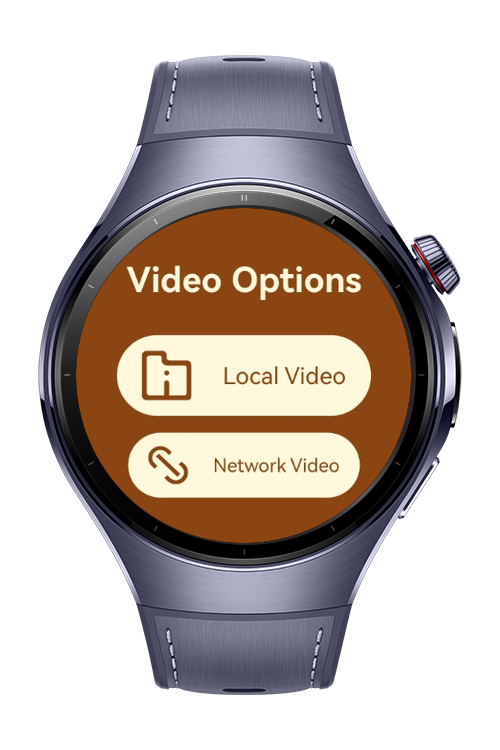
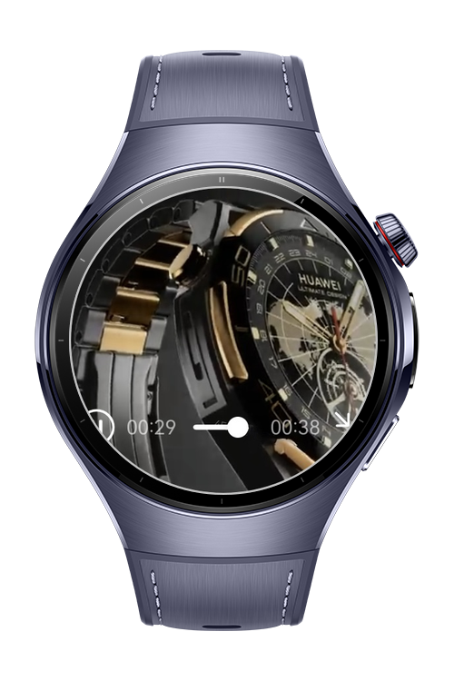

> **Note:** To access all shared projects, get information about environment setup, and view other guides, please visit [Explore-In-HMOS-Wearable Index](https://github.com/Explore-In-HMOS-Wearable/hmos-index).

# LocalNetworkVideoPlayer

LocalNetworkVideoPlayer is a demo app that allows users to play videos either from the device’s local storage or from a given URL, supporting basic playback controls like play and pause.

# Preview

<div>
  
  
  
  
</div>

# Use Cases

LocalNetworkVideoPlayer lets users:
Select and play videos stored locally on the device.
Enter a video URL to stream and play the video directly.
Control playback with play and pause options.

# Tech Stack 

Languages: ArkTS
Frameworks: HarmonyOS SDK 5.1.0(18)
Tools: DevEco Studio Vers 5.1.0.820
Libraries: @kit.ArkUI

# Directory Structure

```
entry/src/main/ets/
|---pages                         
|   |---Index.ets                        // Main page 
|   |---LocalVideoPlayer.ets             // Local video player which uses local rawfile to fetch video.
|   |---NetworkVideoPlayer.ets           // Network video player which sends request to given URL                  
|---view
|   |---VideoPlayerComponent.ets         // Video player component
``` 

# Constraints and Restrictions
## Supported Devices
Huawei Watch 5

# LICENSE

SoccerScore is distributed under the terms of the MIT License.  
See the [LICENSE](/LICENSE) for more information.
